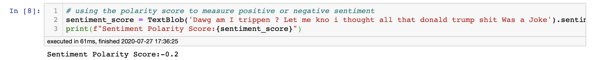
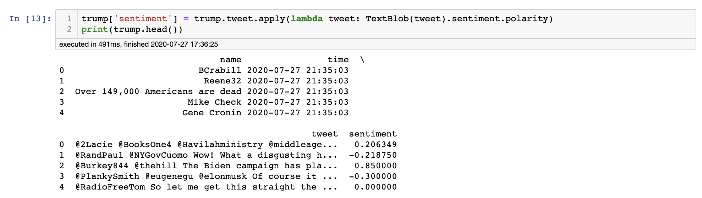
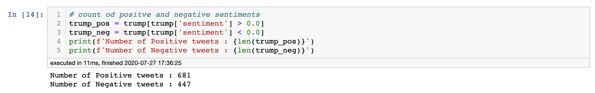
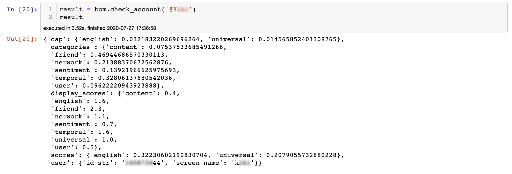

# Twitter Sentiment Analysis & Botometer Bot likelihood
July 2020

For this time around I chose to do a project that focus on my brand spanking new Twitter Api. After thought I wanted do a sentiment analysis on the tweets and to classify if a tweet is either positive or negative. I also had another project in mind and decided to combine them and added Botometer. Botometer is a package that can rate the likelihood the Twitter user is a bot or human at a threshold.

## What Did I Do?

* Twitter Api

  - First had to sign up for a Twitter Api

  - Hid it in a custom .py file so my credentials wouldn't be revoked or get billed from joyriders...

* The Data

  - Wrote a function that uses tweepy's api call to pull tweets using a 'key word'; and returns the pulled tweets as a Pandas DataFrame. Calling tweepy I focused on four features, is tweet the in english, the user name of the tweeter, tweet must not be a retweet and finally the actual tweet as a string.

  - I Pulled 10,000 tweets on each of two topics. First on Donald Trump and then on a Manhwa (Korean Manga) that I love (but it's on hiatus right now) 'Solo Leveling'. It comes highly recommended if your looking for a great action read.

* Sentiment Analysis on tweets:

  - I used a python package (TextBlob) that will provide me with a nice and easy sentiment polarity score. The polarity score is a float with values ranging from -1 to +1 (100% negative sentiment to 100% positive sentiment, respectably).

  - I wrapped sentiment polarity up in a function for easier calling.

  - Next I preformed the sentiment polarity function on the entire dataframe by using a simply lambda function.

Had to censor user info

  - Lastly I classified the sentiment polarity score by positive/negative and displayed the count for each.

  
  
* Botometer

  - Lastly I ran Botometer, using Twitter's Api, on a few users. Botometer runs analysis on whether the user is likely a bot or a human.

Hope You enjoyed my A Twitter Sentiment Analysis & Botometer Project

Add me on LinkedIn if you liked.

## Built With

* Python 3.8
* Jupyter Notebook 6.0.0
* A few of the main imports: pandas, tweepy, requests, TextBlob, Botometer

## Authors

* **Samuel Diaz** - *Creator* - [sdman135](https://github.com/sdman135/) - [LinkedIn](https://www.linkedin.com/in/samuel-diaz-data-scientist)
